# Product Catalog Service

A take-home assignment for FUGA's Java Engineer position on the QC team. The brief asked for a backend service for a music product catalog.

## What I built

A Spring Boot service with two main responsibilities: a REST API supporting full CRUD operations on music products and tracks, including a catalog search endpoint, and an event-driven validation pipeline that processes submissions asynchronously via Kafka.

Product-level validation and track validation run concurrently. After the product passes validation it waits in `AWAITING_TRACK_VALIDATION` until all its tracks pass, only then does it move to `VALIDATED` and become eligible for DSP delivery.

## Architecture
See GitHub for diagram.

```mermaid
---
config:
  layout: dagre
  theme: base
---
flowchart LR
 subgraph Clients["Clients"]
        LABEL_UI["🎵 Label UI"]
  end
 subgraph Core["Product Catalog Service"]
        PAPI["📦 Product API"]
        DB[("🗄️ MariaDB")]
  end
 subgraph Stream["Event Stream"]
        DEB["🔍 Debezium CDC"]
        T1["📨 catalog.music_catalog.products"]
        T2["📨 catalog.music_catalog.tracks"]
  end
 subgraph Validation["Validation Layer"]
        PCONSUMER["⚙️ Product Validation Consumer"]
        TCONSUMER["⚙️ Track Validation Consumer"]
        STATUSCONSUMER["⚙️ Status Update Consumer"]
        RULES["📋 Rule Engine"]
        ORCH["⚙️ Validation Orchestration Service"]
        T3["📨 catalog.validation.status-updates"]
        DLQ["☠️ product-dlq"]
        KTABLE["🗂️ Product Validation State KTable"]
  end
 subgraph Downstream["Downstream"]
        NOTIFY["🔔 Notification Stub"]
        DSP["🌍 DSP Delivery Stub"]
        REVIEWER["🔍 Reviewer Stub"]
  end
    LABEL_UI -- CRUD --> PAPI
    PAPI -- writes --> DB
    DB -- CDC --> DEB
    DEB == products ==> T1
    DEB == tracks ==> T2
    T1 -- SUBMITTED, RESUBMITTED --> PCONSUMER
    T2 -- PENDING --> TCONSUMER
    PCONSUMER --> RULES
    TCONSUMER --> RULES
    RULES --> ORCH
    ORCH == status updates ==> T3
    T3 --> STATUSCONSUMER
    STATUSCONSUMER -- writes --> DB
    PCONSUMER == fatal failure ==> DLQ
    TCONSUMER == fatal failure ==> DLQ
    T1 -- all events --> KTABLE
    T2 -- all events --> KTABLE
    KTABLE -- all tracks validated --> ORCH
    T1 -- VALIDATED, VALIDATION_FAILED, PUBLISHED --> NOTIFY
    T1 -- PUBLISHED, TAKEN_DOWN --> DSP
    T1 -- NEEDS_REVIEW --> REVIEWER

    DEB@{ shape: h-cyl}
    T1@{ shape: h-cyl}
    T2@{ shape: h-cyl}
    T3@{ shape: h-cyl}
    DLQ@{ shape: h-cyl}
    KTABLE@{ shape: h-cyl}
     LABEL_UI:::external
     PAPI:::service
     DB:::storage
     DEB:::infra
     T1:::topic
     T2:::topic
     PCONSUMER:::service
     TCONSUMER:::service
     STATUSCONSUMER:::service
     RULES:::service
     ORCH:::service
     T3:::topic
     DLQ:::topic
     KTABLE:::streams
     NOTIFY:::stub
     DSP:::stub
     REVIEWER:::stub
    classDef external fill:#00F5D4,stroke:#00C4A9,color:#000
    classDef service fill:#F15BB5,stroke:#C1398A,color:#fff
    classDef infra fill:#F4769E,stroke:#C44870,color:#fff
    classDef storage fill:#FEE440,stroke:#C9B400,color:#000
    classDef topic fill:#CBDC65,stroke:#9AAD3A,color:#000
    classDef streams fill:#9B5DE5,stroke:#7a3db8,color:#fff
    classDef stub fill:#00BBF9,stroke:#0090C9,color:#000
    style Clients fill:#fff,stroke:#7a3db8,color:#fff
    style Core fill:#fff,stroke:#7a3db8,color:#fff
    style Stream fill:#fff,stroke:#7a3db8,color:#fff
    style Validation fill:#fff,stroke:#7a3db8,color:#fff
    style Downstream fill:#fff,stroke:#7a3db8,color:#fff
```

## Data model

The domain model is loosely informed by the DDEX standard for music metadata exchange. A `Product` represents a music release (an album, EP, or single) and carries the metadata a distributor needs to identify and deliver a release: UPC, title, artist, label, genre, language, release date, artwork, and DSP targets.

Each product has one or more `Track` entities with their own metadata: ISRC, title, track number, duration, audio file, and explicit flag.

Both products and tracks carry two nested structures: `contributors` (people involved in the release with typed roles like `MAIN_ARTIST` and `COMPOSER`) and `ownershipSplits` (rights holders and their percentage shares). DSP targets on the product determine which platform-specific validation rules are applied at submission time.

## Key decisions

**Parse, don't validate**

The mappers (`ProductEventMapper`, `TrackEventMapper`) normalize and sanitize as they parse. Stripping whitespace, lowercasing language codes, uppercasing ISRCs, converting tinyint to boolean. By the time a `Product` or `Track` reaches the domain it's already in a valid, normalized form. This is informed by Alexis King's "Parse, Don't Validate" principle, the idea that parsing and validation should happen at the boundary so the domain only ever sees well-formed data. Java's type system can't enforce this at compile time the way Haskell or Rust can, but the mappers act as that boundary by convention.

**Debezium for change capture**

Rather than publishing events explicitly from the application, I used Debezium to capture changes from MariaDB's binary log. This means the database is the source of truth and events flow from it naturally, there's no risk of a write succeeding while the event publish fails. Status updates from the validation pipeline follow the same principle, routed through Kafka rather than written directly to the database.

**Keeping business logic out of the consumers**

Early on the consumers were doing too much, rule evaluation, status decisions, rollup logic. I pulled all of that into `ValidationOrchestrationService` so the consumers just deserialize, filter, and delegate. The severity-to-status mapping was duplicated across both consumers before the refactor. Having it in one place means it's testable without Kafka and impossible to accidentally get out of sync.

**Rule engine behind a port**

The domain only knows about `ValidationOutcome`, it never sees `RuleResult` or `RuleSeverity`. I defined a `RuleEngine` port so the consumers depend on an interface, not on the infrastructure classes directly. The rule implementations can change without touching the domain.

**Kafka Streams KTable for submission state**

The tricky part of this problem is knowing when all tracks for a product have finished validating. My first instinct was to query MariaDB on every track event, but that gets chatty at scale. Instead I built a Kafka Streams topology that merges the product and track event streams into a KTable keyed by product ID. The KTable holds the current validation state of each in-flight submission, and when it detects all tracks are validated it triggers the rollup. It's using a "collect-persist-evict" pattern.

The Kafka Streams app lives in the same service as everything else. I wouldn't do that in production, it should be a separate stateful deployment with persistent RocksDB volumes, but for this submission it keeps things self-contained and I've called it out clearly.

**Status update routing through Kafka**

The orchestration service publishes to `catalog.validation.status-updates` rather than writing to MariaDB directly, decoupling validation decisions from persistence and making failures Kafka-native.

## Running locally

Requires Docker and Java 21.
```bash
./init.sh
```
This builds the jar, starts all services, and registers the Debezium connector. The API is available at `http://localhost:8080` once the script completes.

## Running the tests
```bash
./mvnw test
```

Tests use Testcontainers and require Docker. To generate a coverage report:
```bash
./mvnw verify
open target/site/jacoco/index.html
```

## API documentation

The API is documented with Swagger UI. Once the stack is running, open:
```
http://localhost:8080/swagger-ui
```

The full OpenAPI spec is available at:
```
http://localhost:8080/api-docs
```

## Testing with Samples

Sample payloads for testing the pipeline are available in the [samples directory](samples/README.md).

## Observability

The stack includes built-in observability at two levels.

**Infrastructure metrics** 

These are handled by the Confluent Kafka Connect image, which exports JMX metrics covering consumer lag, throughput, and connector health out of the box. Consumer lag on the `product-validation` and `track-validation` consumer groups is the most useful signal for this pipeline. If either falls behind, validation is slow.

**Distributed tracing**

The service includes Micrometer Tracing via the Actuator dependency, but no tracing backend is configured. In production I'd reach for OpenTelemetry with a collector exporting to Tempo or Jaeger. Spring Kafka supports header-based trace context propagation, so a trace started at `POST /products` can follow the event through the validation consumers and into the streams topology, giving a single timeline for the full submission lifecycle.

**What I'd add in production**

In production a mature system would include integration with an observability platform like Datadog or Grafana Stack (Prometheus, Loki, Tempo) to surface metrics, logs, and traces in one place.

Custom Micrometer counters for business outcomes -- products validated, failed, and flagged for review -- exposed via the Actuator metrics endpoint and scraped by Prometheus. These are domain events that infrastructure metrics can't see, and they're the numbers a QC team would actually care about day to day.

A DLQ monitor would also be a first priority, alerting via a Slack webhook whenever a message lands in `product-dlq` so the team can inspect and replay failed messages promptly.

## What I'd do differently with more time

### Structure

**Extract the validation pipeline into its own service.** The product API and the validation pipeline have different operational requirements and should be separate services. The API is stateless and scales horizontally without ceremony. The validation pipeline (consumers, rule engine, and Kafka Streams application) is stateful, event-driven, and needs different scaling characteristics, particularly around the RocksDB state store. Keeping them together made sense for the submission but in production they would be separate deployments.

**Topics as infrastructure** I would not allow the creation of topics and schemas to happen on the fly. I would use an IaC tool like Terraform, Ansible or GitOps to create them for resilience, consistency and to prevent accidental resource sprawl.

### Features/Completeness

**Add Reviewer Controller** For the validation flow I would assume there would be a manual review flow. It is stubbed in this project.

**Kafka Streams Interactive Queries** The KTable state store can be queried directly via Kafka Streams Interactive Queries API, exposing the materialized validation state for any in-flight submission by product ID without hitting MariaDB. This would be a useful debugging endpoint in production, seeing exactly what the topology has materialized for a given product, including the per-track status map, is valuable when investigating why a rollup didn't fire as expected.
The same API could back a real-time state visualization, a live view of in-flight submissions showing which tracks have passed, which are still pending, and where each product is in the validation lifecycle. Useful for a QC team dashboard without any additional database queries.

**Track status history** Track transitions are not recorded; would follow the same pattern as product status history with a `track_status_history` table.

**Expand DSP rule coverage.** The Spotify rules are a proof of concept. A real implementation would have rules per DSP with proper configuration, and the rule sets would likely be data-driven rather than hardcoded.

**Authentication and authorization** Currently any caller can submit, update, or delete any product. In production, the API would sit behind an identity provider like Okta. Labels would authenticate via OAuth2 and their token would scope them to their own catalog, a label can only read and modify their own products. The `changed_by_id` field on status history is already nullable and waiting for this, once authentication is in place, the authenticated label account ID would populate that field on every resubmission, giving a full audit trail of who changed what and when.

### Safety Checks

**Add a clean intermediate topic between Debezium and the consumers.** Right now the consumers parse the Debezium envelope directly. If we ever change CDC tooling, the consumers break. A thin translator producing to a stable domain event topic would decouple the two concerns properly.

**Control status transitions** I might apply a check on status transitions so that they could not accidentally flow in an illogical direction without review.

**Contract testing** would be used to ensure that the API delivers what the UI expects.

### CI/CD

**Kubernetes deployment** The validation pipeline has two distinct operational profiles that would drive the Kubernetes deployment strategy. The product API is stateless and scales horizontally with a standard `Deployment`. The Kafka Streams topology is stateful, it maintains a RocksDB state store that needs to survive pod restarts. That means a `StatefulSet` with a persistent volume claim per replica, careful partition assignment so each replica owns a consistent subset of partitions, and a readiness probe backed by the custom `KafkaStreamsHealthIndicator` so traffic only routes to pods whose topology is in `RUNNING` state. The Debezium connector registration, currently handled by `init.sh`, would move to a Kubernetes `Job` that runs after Kafka Connect is healthy, using an init container or a readiness gate to sequence the startup correctly.

**Security scanning and pre-commit hooks** In production I'd add Snyk or Dependabot to scan dependencies for known vulnerabilities, integrated into the GitHub Actions pipeline so a failing scan blocks the deployment. Pre-commit hooks via Husky or a simple shell script would catch obvious issues before they hit CI, at minimum a checkstyle run and a quick `./mvnw test` on changed modules. The goal is to catch things as early as possible rather than waiting for the deployment pipeline to fail.

**Reliability, Fault Tolerance and Performance** A production system would never have only one deployment. There would be more than one environment, usually three. Everything in each environment would be replicated. There would be multiple nodes of the applications, multiple replicas of the topics. There would be a replica or some way to recover the database. There would be a load balancer in front of the servers.

**Semantic Versioning** I would implement semantic versioning to guard against breaking changes.