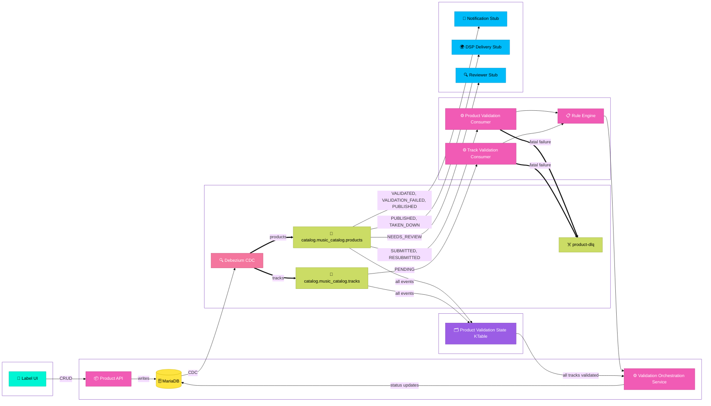

# Product Catalog Service

A take-home assignment for FUGA's Java Engineer position on the QC team. The brief asked for a backend service for a music product catalog.

## What I built

A Spring Boot service with two main responsibilities: a REST API supporting full CRUD operations on music products and tracks, and an event-driven validation pipeline that processes submissions asynchronously via Kafka.

Product-level validation and track validation run concurrently. A product waits in `AWAITING_TRACK_VALIDATION` until all its tracks pass -- only then does it move to `VALIDATED` and become eligible for DSP delivery.

## Architecture


## Key decisions

**Parse, don't validate**

The mappers (`ProductEventMapper`, `TrackEventMapper`, `ProductMapper`) don't just copy fields -- they normalize and sanitize as they parse. Stripping whitespace, lowercasing language codes, uppercasing ISRCs, converting tinyint to boolean. By the time a `Product` or `Track` reaches the domain it's already in a valid, normalized form. This is informed by Alexis King's "Parse, Don't Validate" principle -- the idea that parsing and validation should happen at the boundary so the domain only ever sees well-formed data. Java's type system can't enforce this at compile time the way Haskell or Rust can, but the mappers act as that boundary by convention.

**Debezium for change capture**

Rather than publishing events explicitly from the application, I used Debezium to capture changes from MariaDB's binary log. This means the database is the source of truth and events flow from it naturally -- there's no risk of a write succeeding while the event publish fails. I've worked with this pattern before and it's one I trust.

**Keeping business logic out of the consumers**

Early on the consumers were doing too much -- rule evaluation, status decisions, rollup logic. I pulled all of that into `ValidationOrchestrationService` so the consumers just deserialize, filter, and delegate. The severity-to-status mapping was duplicated across both consumers before the refactor. Having it in one place means it's testable without Kafka and impossible to accidentally get out of sync.

**Rule engine behind a port**

The domain only knows about `ValidationOutcome` -- it never sees `RuleResult` or `RuleSeverity`. I defined a `RuleEngine` port so the consumers depend on an interface, not on the infrastructure classes directly. The rule implementations can change without touching the domain.

**Kafka Streams KTable for submission state**

The tricky part of this problem is knowing when all tracks for a product have finished validating. My first instinct was to query MariaDB on every track event, but that gets chatty at scale. Instead I built a Kafka Streams topology that merges the product and track event streams into a KTable keyed by product ID. The KTable holds the current validation state of each in-flight submission, and when it detects all tracks are validated it triggers the rollup.

The Kafka Streams app lives in the same service as everything else. I wouldn't do that in production -- it should be a separate stateful deployment with persistent RocksDB volumes -- but for this submission it keeps things self-contained and I've called it out clearly.

**Product-level validation doesn't check for tracks**

The product validation consumer receives a Debezium CDC event containing only the columns of the `products` table. Tracks live in a separate table and aren't included. When the mapper reconstructs a `Product` from the CDC event, the track list is always null -- so any rule checking track existence would always fail regardless of whether tracks were actually submitted. Track existence is already enforced at the API boundary, so the rule is redundant and was removed.

## Running locally

Requires Docker and Java 21.
```bash
./init.sh
```

This builds the jar, starts all services, and registers the Debezium connector. The API is available at `http://localhost:8080` once the script completes.

## Running the tests
```bash
./mvnw test
```

Tests use Testcontainers and require Docker. To generate a coverage report:
```bash
./mvnw verify
open target/site/jacoco/index.html
```

## API documentation

The API is documented with Swagger UI. Once the stack is running, open:
```
http://localhost:8080/swagger-ui
```

The full OpenAPI spec is available at:
```
http://localhost:8080/api-docs
```

## Testing with Samples

Sample payloads for testing the pipeline are available in the [samples directory](samples/README.md).

## Observability

The stack includes built-in observability at two levels.

**Infrastructure metrics** are handled by the Confluent Kafka Connect image, which exports JMX metrics covering consumer lag, throughput, and connector health out of the box. Consumer lag on the `product-validation` and `track-validation` consumer groups is the most useful signal for this pipeline -- if either falls behind, validation is slow.

**Distributed tracing**

The service includes Micrometer Tracing via the Actuator dependency, but no tracing backend is configured. In production I'd reach for OpenTelemetry with a collector exporting to Tempo or Jaeger.

If a consumer was lagging, my first three checks would be consumer lag and offset (is it falling behind and at what rate), resource utilization (is the consumer CPU or memory bound, or is it blocked on I/O), and distributed traces (is a specific message type taking significantly longer to process than others, pointing to a rule or a DB query as the bottleneck). Tracing is particularly useful here because a slow rule evaluation or a slow MariaDB read inside the validation consumer would show up as a long span, which lag metrics alone can't tell you.

Spring Kafka supports header-based trace context propagation, so a trace started at `POST /products` can follow the event through the validation consumers and into the streams topology, giving a single timeline for the full submission lifecycle.

**Local debugging commands**

When running locally, the following commands are useful for inspecting the pipeline without a UI:

Check consumer lag for the validation consumers:
```bash
docker exec kafka /opt/kafka/bin/kafka-consumer-groups.sh \
  --bootstrap-server localhost:9092 \
  --describe \
  --group product-validation

docker exec kafka /opt/kafka/bin/kafka-consumer-groups.sh \
  --bootstrap-server localhost:9092 \
  --describe \
  --group track-validation
```

Check Debezium connector status:
```bash
curl http://localhost:8083/connectors/music-catalog-connector/status
```

Inspect messages in the products topic:
```bash
docker exec kafka /opt/kafka/bin/kafka-console-consumer.sh \
  --bootstrap-server localhost:9092 \
  --topic catalog.music_catalog.products \
  --from-beginning \
  --max-messages 10
```

Inspect the DLQ:
```bash
docker exec kafka /opt/kafka/bin/kafka-console-consumer.sh \
  --bootstrap-server localhost:9092 \
  --topic product-dlq \
  --from-beginning
```

Check Kafka Streams application state:
```bash
curl http://localhost:8080/actuator/health
```

The `kafkaStreams` component will show one of the following states: `RUNNING`, `REBALANCING`, `ERROR`, `PAUSED`, or `NOT_RUNNING`. `REBALANCING` is normal on startup or after a redeployment -- it means the topology is reassigning partitions. `ERROR` means the streams thread has died and needs investigation.

Check how many records the topology has processed:
```bash
docker logs product-catalog-service | grep "Processed [^0] total records"
```

This filters the Kafka Streams periodic summary log for any poll cycle where records were actually processed, which is useful for confirming the topology is consuming events rather than sitting idle.

These are the same metrics AKHQ surfaces in its UI -- it uses the Kafka Connect REST API and Kafka AdminClient under the hood.

**Application health** is exposed via Spring Boot Actuator at `http://localhost:8080/actuator/health`. All status transitions are logged at INFO level, so the validation pipeline is fully traceable through the application logs:
```bash
docker logs product-catalog-service | grep "transitioned to"
```

**What I'd add in production**

Custom Micrometer counters for business outcomes -- products validated, failed, and flagged for review -- exposed via the Actuator metrics endpoint and scraped by Prometheus. These are domain events that infrastructure metrics can't see, and they're the numbers a QC team would actually care about day to day. The natural place for these counters is the application layer, in the consumers after the orchestration service call, so the domain stays clean.

A DLQ monitor would also be a first priority -- alerting via a Slack webhook whenever a message lands in `product-dlq` so the team can inspect and replay failed messages promptly.

## What I'd do differently with more time

**Extract the validation pipeline into its own service.** The product API and the validation pipeline have different operational requirements and should be separate services. The API is stateless and scales horizontally without ceremony. The validation pipeline (consumers, rule engine, and Kafka Streams application) is stateful, event-driven, and needs different scaling characteristics, particularly around the RocksDB state store. Keeping them together made sense for the submission but in production they would be separate deployments.

**Kubernetes deployment** The validation pipeline has two distinct operational profiles that would drive the Kubernetes deployment strategy. The product API is stateless and scales horizontally with a standard `Deployment`. The Kafka Streams topology is stateful -- it maintains a RocksDB state store that needs to survive pod restarts. That means a `StatefulSet` with a persistent volume claim per replica, careful partition assignment so each replica owns a consistent subset of partitions, and a readiness probe backed by the custom `KafkaStreamsHealthIndicator` so traffic only routes to pods whose topology is in `RUNNING` state. The Debezium connector registration, currently handled by `init.sh`, would move to a Kubernetes `Job` that runs after Kafka Connect is healthy, using an init container or a readiness gate to sequence the startup correctly.

**Add a clean intermediate topic between Debezium and the consumers.** Right now the consumers parse the Debezium envelope directly. If we ever change CDC tooling, the consumers break. A thin translator producing to a stable domain event topic would decouple the two concerns properly.

**Authentication and authorization** Currently any caller can submit, update, or delete any product. In production, the API would sit behind an identity provider like Okta. Labels would authenticate via OAuth2 and their token would scope them to their own catalog -- a label can only read and modify their own products. The `changed_by_id` field on status history is already nullable and waiting for this -- once authentication is in place, the authenticated label account ID would populate that field on every resubmission, giving a full audit trail of who changed what and when.

**Expand DSP rule coverage.** The Spotify rules are a proof of concept. A real implementation would have rules per DSP with proper configuration, and the rule sets would likely be data-driven rather than hardcoded.

**Security scanning and pre-commit hooks** In production I'd add Snyk or Dependabot to scan dependencies for known vulnerabilities, integrated into the GitHub Actions pipeline so a failing scan blocks the deployment. Pre-commit hooks via Husky or a simple shell script would catch obvious issues before they hit CI -- at minimum a checkstyle run and a quick `./mvnw test` on changed modules. The goal is to catch things as early as possible rather than waiting for the deployment pipeline to fail.