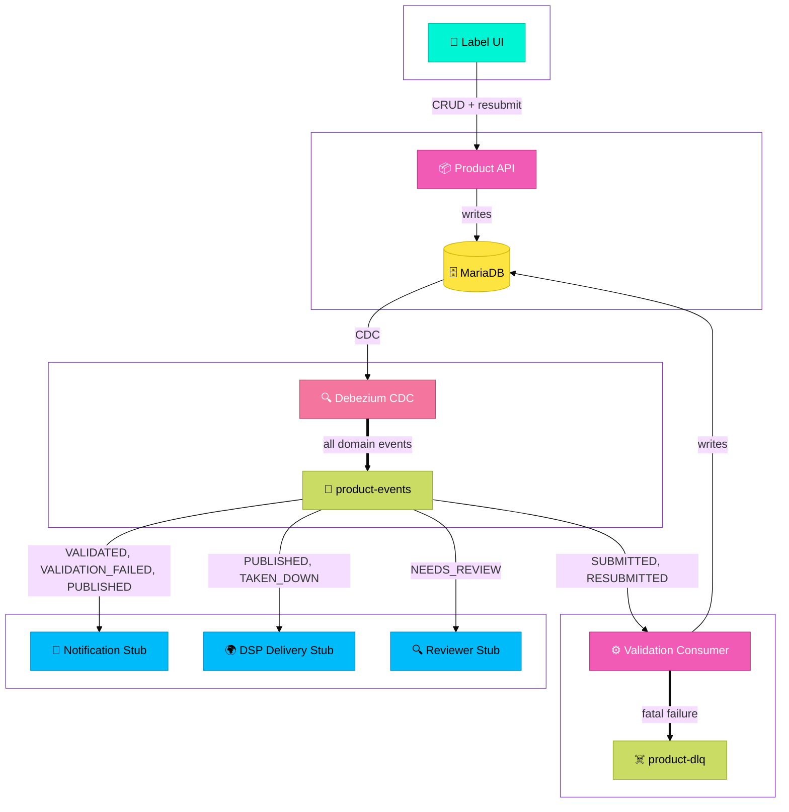

# Product Catalog Service

An event-driven backend service for managing a music product catalog. When things happen in the catalog -- a product is submitted, validated, published, or taken down -- the rest of the system knows about it.

Built as a take-home engineering assessment for FUGA.

---

## Architecture

This service is a product catalog API backed by an event-driven architecture. Labels submit music products via the REST API, which writes to MariaDB. Debezium tails the binary log and produces domain events to Kafka as a guaranteed side effect of every committed write. Downstream consumers subscribe to the event stream and react to the statuses relevant to their domain.

The service includes a QC validation consumer as one example of a downstream consumer -- it picks up submitted products, runs them through a layered rule engine, and writes the validation outcome back to the catalog. Other consumers stub out notification and DSP delivery workflows.



### Key architectural decisions

**Clean domain boundary.** The catalog domain contains only product lifecycle concepts -- `Product`, `ProductStatus`, contributors, ownership splits. QC validation logic lives entirely in the infrastructure layer as a consumer concern, not a catalog concern. The domain has no knowledge of rules, rule results, or validation outcomes.

**Change Data Capture via Debezium** eliminates the dual write problem. The application writes only to MariaDB. Debezium tails the binary log and produces domain events to Kafka as a guaranteed side effect of committed writes. No event is ever lost due to a service crash between a DB write and a Kafka produce.

**QC validation as a consumer.** The validation consumer is one of several consumers reacting to catalog events. It runs submitted products through an extensible rule engine and writes status updates back to the catalog via the repository. This is decoupled from the catalog API -- the API has no knowledge of validation logic.

**DB-first over event sourcing.** A stream-first architecture was considered and rejected. Music catalog submission volumes do not justify the operational complexity of Kafka as a system of record. A well-indexed MariaDB handles the load trivially.

**Layered validation.** Validation happens in two stages: structural inspection in the domain layer (is the product well-formed?) and business rule evaluation in the infrastructure layer (does it meet platform standards?). Rules are separated into universal rules that apply to all DSPs and DSP-specific rules. The rule engine is extensible -- adding a new DSP requires only a new rule class and a config entry.

**Single service, three components.** The Kafka consumer, validation rule engine, Product API, and Review API live in one Spring Boot application. The Product API and Review API are intentionally separated into distinct controllers -- they serve different clients (labels and reviewers) with different workflows and URL namespaces. All components share the same domain data and belong to the QC bounded context. At higher volumes the validation consumer could be split into its own service for independent scaling -- this is captured in the decision record.

**Sequential rule execution.** Rules run sequentially rather than in parallel. For in-memory checks the overhead of parallel streams outweighs the benefit. If rules require external I/O (checking against a copyright registry, for example), `parallelStream()` makes this a trivial change.

Full decision records are documented in [DECISIONS.md](DECISIONS.md).

---

## Domain model

A `Product` represents a music release in FUGA's catalog. It carries:

- **Identifiers:** UPC (release), ISRC (sound recording)
- **Descriptive metadata:** title, genre, language, release date, explicit flag
- **Contributors:** a list of named contributors with roles (MAIN_ARTIST, FEATURED_ARTIST, PRODUCER, etc.)
- **Ownership splits:** rights holders and their percentage of ownership, which must sum to 100%
- **Content references:** audio file URI and artwork URI
- **DSP targets:** which platforms the product should be delivered to

The model was informed by industry research into music metadata standards. See [ADR-006](DECISIONS.md) for the reference.

### Validation outcomes

| Status | Meaning |
|---|---|
| `SUBMITTED` | Product received, awaiting validation |
| `RESUBMITTED` | Label resubmitted after a rejection |
| `VALIDATED` | Passed all rules, ready for distribution |
| `VALIDATION_FAILED` | Failed one or more blocking rules, returned to label |
| `NEEDS_REVIEW` | Flagged for human review due to warning-level rules |
| `PUBLISHED` | Delivered to DSPs (handled downstream) |
| `TAKEN_DOWN` | Removed from DSPs (handled downstream) |

---

## Tech stack

- Java 21, Spring Boot 3.5
- MariaDB 11 with Flyway migrations
- Apache Kafka (KRaft mode, no Zookeeper)
- Debezium MySQL connector for CDC
- Spring Kafka for consumer
- Docker Compose for local infrastructure

---

## Running locally

### Prerequisites

- Docker and Docker Compose
- Java 21
- Maven

### Start infrastructure

```bash
./init.sh
```

This starts Kafka, MariaDB, and Kafka Connect, then registers the Debezium connector. Wait for all containers to be healthy before starting the application.

### Start the application

```bash
./mvnw spring-boot:run
```

Flyway will automatically run database migrations on startup.

### Environment variables

| Variable | Default | Description |
|---|---|---|
| `DB_URL` | `jdbc:mariadb://localhost:3306/music_catalog` | MariaDB connection URL |
| `DB_USERNAME` | `catalog` | Database username |
| `DB_PASSWORD` | `catalog` | Database password |
| `KAFKA_BOOTSTRAP_SERVERS` | `localhost:9092` | Kafka bootstrap servers |

---

## Running the tests

```bash
./mvnw test
```

Tests are unit tests using JUnit 5 and Mockito. Infrastructure dependencies are mocked. Integration tests using Testcontainers are identified as a next step.

---

## API

### Product API

#### Create a product
```
POST /products
```

Creates a new product and sets its status to `SUBMITTED`, triggering the validation pipeline.

#### Get a product
```
GET /products/{id}
```

#### Get all products
```
GET /products
```

#### Update a product
```
PUT /products/{id}
```

Replaces the full product record. Only meaningful when a product is in `VALIDATION_FAILED` status -- use to correct data before resubmitting.

#### Resubmit a product
```
POST /products/{id}/resubmit
```

Explicitly triggers resubmission. Sets status to `RESUBMITTED` and kicks off the validation pipeline. Returns `400` if the product is not in `VALIDATION_FAILED` status.

#### Delete a product
```
DELETE /products/{id}
```

---

## Resilience

**Dead Letter Queue.** Messages that cannot be processed after retries are routed to `product-dlq` with the full payload preserved for inspection and replay. `RuntimeException` is configured as non-retryable -- permanent failures (malformed events, invalid IDs) go directly to DLQ without retrying.

**DLQ monitoring.** In production a dedicated consumer would monitor `product-dlq` and alert via Slack webhook when messages arrive. This is outside the scope of this submission but would be a first priority before going to production.

---

## Observability

Spring Boot Actuator is enabled. Health and metrics are available at `/actuator`.

In production this service would be instrumented with distributed tracing (OpenTelemetry) to track latency through the validation pipeline, and Kafka consumer lag would be monitored as the primary signal for scaling decisions.

---

## What I would do with more time

- **Integration tests** using Testcontainers for the persistence layer and Kafka consumer
- **Status history tracking** -- a `product_status_history` table recording each status transition with timestamp and reason. Critical for the resubmission workflow -- ops teams need visibility into why a product failed and what changed between submissions. Debezium would pick this up automatically, so history tracking and event auditability come for free given the existing architecture.
- **DLQ consumer** with Slack alerting for operational visibility
- **More DSP rule sets** -- Apple Music, Amazon Music, YouTube
- **Rule configuration from database** -- allow non-engineers to add and modify rules without a deployment
- **Parallel rule execution** if external I/O calls are introduced into the rule engine
- **Split the service** -- separate the validation consumer from the product API if volume requires independent scaling
- **Schema registry** -- Avro schemas for Kafka events rather than raw JSON
- **Authentication** on the Product API -- currently unauthenticated, would integrate with an identity provider (Okta) in production, with label accounts scoped to their own catalog entries
---

## Project structure

```
src/main/java/com/productcatalog/
├── application/
│   ├── kafka/          -- Validation consumer, downstream stubs, event DTO, mapper
│   └── rest/           -- Product API, request DTOs, mapper
├── domain/
│   ├── model/          -- Product, ProductStatus, contributors, ownership splits
│   └── ports/          -- ProductRepository
└── infrastructure/
    ├── messaging/      -- Kafka configuration, DLQ routing
    ├── persistence/    -- JPA entity, repository, adapter
    └── rules/          -- RuleEngine, ValidationResult, UniversalRules, SpotifyRules
```

