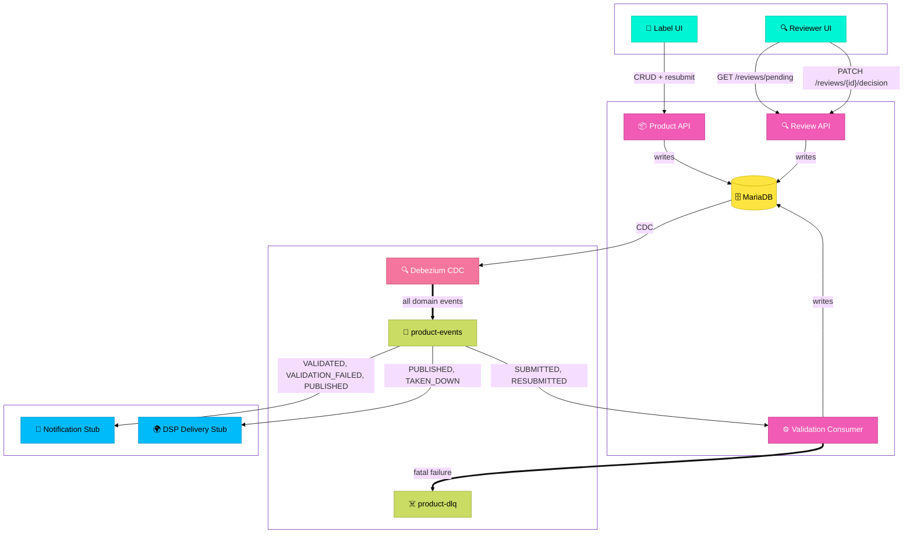

# Product Validation Service

An event-driven backend service that validates music product submissions against quality control rules before they are distributed to Digital Service Providers (DSPs) such as Spotify and Apple Music.

Built for FUGA's QC team as a take-home engineering assessment.

---

## Architecture

This service sits at the heart of FUGA's content pipeline. Labels submit music products via the Product API, which writes to MariaDB. Debezium tails the binary log and produces domain events to Kafka as a guaranteed side effect of every committed write. The Validation Consumer picks up submitted products, runs them through a layered rule engine, and updates their status. A separate Review API handles the human review workflow for products that require manual intervention.



### Key architectural decisions

**Change Data Capture via Debezium** eliminates the dual write problem. The application writes only to MariaDB. Debezium tails the binary log and produces domain events to Kafka as a guaranteed side effect of committed writes. No event is ever lost due to a service crash between a DB write and a Kafka produce.

**DB-first over event sourcing.** A stream-first architecture was considered and rejected. Music catalog submission volumes do not justify the operational complexity of Kafka as a system of record. A well-indexed MariaDB handles the load trivially.

**Layered validation.** Validation happens in two stages: structural inspection in the domain layer (is the product well-formed?) and business rule evaluation in the infrastructure layer (does it meet platform standards?). Rules are separated into universal rules that apply to all DSPs and DSP-specific rules. The rule engine is extensible -- adding a new DSP requires only a new rule class and a config entry.

**Single service, three components.** The Kafka consumer, validation rule engine, Product API, and Review API live in one Spring Boot application. The Product API and Review API are intentionally separated into distinct controllers -- they serve different clients (labels and reviewers) with different workflows and URL namespaces. All components share the same domain data and belong to the QC bounded context. At higher volumes the validation consumer could be split into its own service for independent scaling -- this is captured in the decision record.

**Sequential rule execution.** Rules run sequentially rather than in parallel. For in-memory checks the overhead of parallel streams outweighs the benefit. If rules require external I/O (checking against a copyright registry, for example), `parallelStream()` makes this a trivial change.

**No Redis.** The reviewer UI is an internal tool used by a small team. Read load does not justify a cache. A status index on MariaDB is sufficient. Redis would be reconsidered if label-facing dashboard queries created measurable DB read pressure.

Full decision records are documented in [DECISIONS.md](DECISIONS.md).

---

## Domain model

A `Product` represents a music release in FUGA's catalog. It carries:

- **Identifiers:** UPC (release), ISRC (sound recording)
- **Descriptive metadata:** title, genre, language, release date, explicit flag
- **Contributors:** a list of named contributors with roles (MAIN_ARTIST, FEATURED_ARTIST, PRODUCER, etc.)
- **Ownership splits:** rights holders and their percentage of ownership, which must sum to 100%
- **Content references:** audio file URI and artwork URI
- **DSP targets:** which platforms the product should be delivered to

The model was informed by industry research into music metadata standards. See [ADR-006](DECISIONS.md) for the reference.

### Validation outcomes

| Status | Meaning |
|---|---|
| `SUBMITTED` | Product received, awaiting validation |
| `RESUBMITTED` | Label resubmitted after a rejection |
| `VALIDATED` | Passed all rules, ready for distribution |
| `VALIDATION_FAILED` | Failed one or more blocking rules, returned to label |
| `NEEDS_REVIEW` | Flagged for human review due to warning-level rules |
| `PUBLISHED` | Delivered to DSPs (handled downstream) |
| `TAKEN_DOWN` | Removed from DSPs (handled downstream) |

---

## Tech stack

- Java 21, Spring Boot 3.5
- MariaDB 11 with Flyway migrations
- Apache Kafka (KRaft mode, no Zookeeper)
- Debezium MySQL connector for CDC
- Spring Kafka for consumer
- Docker Compose for local infrastructure

---

## Running locally

### Prerequisites

- Docker and Docker Compose
- Java 21
- Maven

### Start infrastructure

```bash
./init.sh
```

This starts Kafka, MariaDB, and Kafka Connect, then registers the Debezium connector. Wait for all containers to be healthy before starting the application.

### Start the application

```bash
./mvnw spring-boot:run
```

Flyway will automatically run database migrations on startup.

### Environment variables

| Variable | Default | Description |
|---|---|---|
| `DB_URL` | `jdbc:mariadb://localhost:3306/music_catalog` | MariaDB connection URL |
| `DB_USERNAME` | `catalog` | Database username |
| `DB_PASSWORD` | `catalog` | Database password |
| `KAFKA_BOOTSTRAP_SERVERS` | `localhost:9092` | Kafka bootstrap servers |

---

## Running the tests

```bash
./mvnw test
```

Tests are unit tests using JUnit 5 and Mockito. Infrastructure dependencies are mocked. Integration tests using Testcontainers are identified as a next step.

---

## API

### Product API

#### Create a product
```
POST /products
```

Creates a new product and sets its status to `SUBMITTED`, triggering the validation pipeline.

#### Get a product
```
GET /products/{id}
```

#### Get all products
```
GET /products
```

#### Update a product
```
PUT /products/{id}
```

Replaces the full product record. Only meaningful when a product is in `VALIDATION_FAILED` status -- use to correct data before resubmitting.

#### Resubmit a product
```
POST /products/{id}/resubmit
```

Explicitly triggers resubmission. Sets status to `RESUBMITTED` and kicks off the validation pipeline. Returns `400` if the product is not in `VALIDATION_FAILED` status.

#### Delete a product
```
DELETE /products/{id}
```

---

### Review API

#### Get pending reviews
```
GET /reviews/pending
```

Returns all products with status `NEEDS_REVIEW`.

#### Submit a review decision
```
PATCH /reviews/{id}/decision
```
```json
{
  "status": "VALIDATED",
  "notes": "Release date verified with label -- intentional back-catalogue release"
}
```

Valid status values: `VALIDATED`, `VALIDATION_FAILED`. Notes are required and will be prefixed with "Manual review: " in the database.
---

## Resilience

**Dead Letter Queue.** Messages that cannot be processed after retries are routed to `product-dlq` with the full payload preserved for inspection and replay. `RuntimeException` is configured as non-retryable -- permanent failures (malformed events, invalid IDs) go directly to DLQ without retrying.

**DLQ monitoring.** In production a dedicated consumer would monitor `product-dlq` and alert via Slack webhook when messages arrive. This is outside the scope of this submission but would be a first priority before going to production.

---

## Observability

Spring Boot Actuator is enabled. Health and metrics are available at `/actuator`.

In production this service would be instrumented with distributed tracing (OpenTelemetry) to track latency through the validation pipeline, and Kafka consumer lag would be monitored as the primary signal for scaling decisions.

---

## What I would do with more time

- **Integration tests** using Testcontainers for the persistence layer and Kafka consumer
- **Status history tracking** -- a `product_status_history` table recording each status transition with timestamp and reason. Critical for the resubmission workflow -- ops teams need visibility into why a product failed and what changed between submissions. Debezium would pick this up automatically, so history tracking and event auditability come for free given the existing architecture.
- **DLQ consumer** with Slack alerting for operational visibility
- **More DSP rule sets** -- Apple Music, Amazon Music, YouTube
- **Rule configuration from database** -- allow non-engineers to add and modify rules without a deployment
- **Parallel rule execution** if external I/O calls are introduced into the rule engine
- **Split the service** -- separate the validation consumer from the reviewer API if volume requires independent scaling
- **Schema registry** -- Avro schemas for Kafka events rather than raw JSON
- **Authentication** on the reviewer API -- currently unauthenticated, would integrate with an identity provider (Okta) in production

---

## Project structure

```
src/main/java/com/productvalidation/
├── application/
│   ├── kafka/          -- Kafka consumer, event DTO, mapper
│   └── rest/           -- Product API, Review API, request DTOs
├── domain/
│   ├── model/          -- Product, ValidationResult, RuleResult, enums
│   ├── ports/          -- Repository, RuleEngine, ValidationService interfaces
│   └── service/        -- ValidationServiceImpl
└── infrastructure/
    ├── messaging/      -- Kafka configuration, DLQ routing
    ├── persistence/    -- JPA entity, repository, adapter
    └── rules/          -- UniversalRules, SpotifyRules, RuleEngineImpl
```

