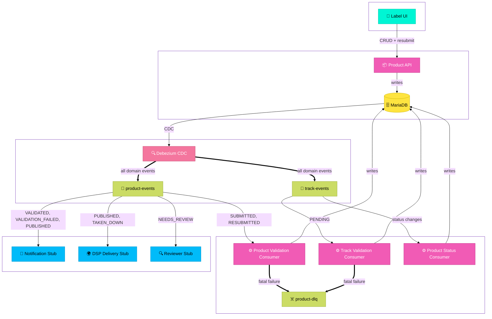

# Product Catalog Service

An event-driven backend service for managing a music product catalog. When things happen in the catalog -- a product is submitted, validated, published, or taken down -- the rest of the system knows about it.

Built as a take-home engineering assessment for FUGA.

---

## Architecture

This service is a product catalog API backed by an event-driven architecture. Labels submit music products with their tracks via the REST API, which writes to MariaDB. Debezium tails the binary log and produces domain events to Kafka as a guaranteed side effect of every committed write.

Validation is split into two independent pipelines. The Product Validation Consumer validates release-level fields when a product is submitted or resubmitted. On pass it sets the product to `AWAITING_TRACK_VALIDATION` and track validation begins. The Track Validation Consumer validates each track independently against universal and DSP-specific rules. The Product Status Consumer listens for track status changes and recomputes the product status once all tracks have been evaluated.

Other consumers stub out notification, DSP delivery, and reviewer routing workflows.



### Key architectural decisions

**Clean domain boundary.** The catalog domain contains only product lifecycle concepts -- `Product`, `ProductStatus`, contributors, ownership splits. QC validation logic lives entirely in the infrastructure layer as a consumer concern, not a catalog concern. The domain has no knowledge of rules, rule results, or validation outcomes.

**Track as a first-class domain concept.** A `Product` is a release container. A `Track` is a sound recording within that release. ISRC, audio file URI, duration, explicit flag, contributor credits, and ownership splits live on `Track`. UPC, artwork, DSP targets, and release-level ownership splits live on `Product`. This reflects how the music industry actually models releases and recordings, and enables track-level validation, failure, and resubmission independently of the parent release.

**Change Data Capture via Debezium** eliminates the dual write problem. The application writes only to MariaDB. Debezium tails the binary log and produces domain events to Kafka as a guaranteed side effect of committed writes. No event is ever lost due to a service crash between a DB write and a Kafka produce.

**Track-level validation pipeline.** Validation is split into two independent pipelines. The Product Validation Consumer validates release-level fields and writes `AWAITING_TRACK_VALIDATION` on pass. The Track Validation Consumer validates each track independently against universal and DSP-specific rules and writes the track's status. The Product Status Consumer recomputes the product status from all track statuses once no tracks remain in `PENDING`. This means a single failing track does not block the entire release -- labels can fix and resubmit individual tracks without touching the others.

**DB-first over event sourcing.** A stream-first architecture was considered and rejected. Music catalog submission volumes do not justify the operational complexity of Kafka as a system of record. A well-indexed MariaDB handles the load trivially.

**Single service for assessment purposes.** The catalog API, validation consumer, and downstream stubs live in one Spring Boot application. In production these would be separate services -- the validation consumer and catalog API have different scaling characteristics and different deployment concerns. This consolidation is a pragmatic choice for this submission.

**Sequential rule execution.** Rules run sequentially rather than in parallel. For in-memory checks the overhead of parallel streams outweighs the benefit. If rules require external I/O (checking against a copyright registry, for example), `parallelStream()` makes this a trivial change.

**No Redis.** Read load on the catalog API does not justify a cache at reasonable submission volumes. A well-indexed MariaDB is sufficient. Redis would be reconsidered if label-facing status polling created measurable DB read pressure.

**Status transition history.** Every status transition is recorded in `product_status_history` with the previous status, new status, actor type (`SYSTEM`, `REVIEWER`, `LABEL`), optional actor identity, and timestamp. This gives ops teams full visibility into a product's lifecycle and is critical for the resubmission workflow -- reviewers need to see why a product failed and what changed between submissions.

Full decision records are documented in [DECISIONS.md](DECISIONS.md).

---

## Domain model

A `Product` represents a music release in FUGA's catalog. It carries release-level metadata:

- **Identifiers:** UPC (release barcode)
- **Descriptive metadata:** title, genre, language, release date
- **Content references:** artwork URI
- **DSP targets:** which platforms the product should be delivered to
- **Ownership splits:** rights holders and their percentage of ownership, which must sum to 100%

A `Track` represents a sound recording within a release. It carries recording-level metadata:

- **Identifiers:** ISRC (sound recording code)
- **Descriptive metadata:** title, track number, duration, explicit flag
- **Content references:** audio file URI
- **Contributors:** named contributors with roles (MAIN_ARTIST, FEATURED_ARTIST, PRODUCER, etc.)
- **Ownership splits:** rights holders and their percentage of ownership, which must sum to 100%

A product's `explicit` flag is derived -- a release is explicit if any of its tracks are explicit.

The model was informed by industry research into music metadata standards. See [ADR-005](DECISIONS.md) for the reference.

### Product status lifecycle

| Status | Meaning |
|---|---|
| `SUBMITTED` | Product received, awaiting product-level validation |
| `RESUBMITTED` | Label resubmitted after a product-level rejection |
| `AWAITING_TRACK_VALIDATION` | Product-level validation passed, tracks being validated |
| `VALIDATION_FAILED` | Product-level or one or more track validations failed |
| `NEEDS_REVIEW` | One or more tracks flagged for human review, none failed |
| `VALIDATED` | All validations passed, ready for distribution |
| `PUBLISHED` | Delivered to DSPs (handled downstream) |
| `TAKEN_DOWN` | Removed from DSPs (handled downstream) |
| `RETIRED` | Permanently removed from the catalog, terminal state |

### Track status lifecycle

| Status | Meaning |
|---|---|
| `PENDING` | Track received, awaiting validation |
| `VALIDATED` | Passed all rules |
| `VALIDATION_FAILED` | Failed one or more blocking rules |
| `NEEDS_REVIEW` | Flagged for human review due to warning-level rules |
| `PUBLISHED` | Delivered to DSPs |
| `TAKEN_DOWN` | Removed from DSPs |
| `RETIRED` | Permanently removed, terminal state |

---

## Tech stack

- Java 21, Spring Boot 3.5
- MariaDB 11 with Flyway migrations
- Apache Kafka (KRaft mode, no Zookeeper)
- Debezium MySQL connector for CDC
- Spring Kafka for consumer
- Docker Compose for local infrastructure

---

## Running locally

### Prerequisites

- Docker and Docker Compose
- Java 21
- Maven

### Start infrastructure

```bash
./init.sh
```

This starts Kafka, MariaDB, and Kafka Connect, then registers the Debezium connector. Wait for all containers to be healthy before starting the application.

### Start the application

```bash
./mvnw spring-boot:run
```

Flyway will automatically run database migrations on startup.

### Environment variables

| Variable | Default | Description |
|---|---|---|
| `DB_URL` | `jdbc:mariadb://localhost:3306/music_catalog` | MariaDB connection URL |
| `DB_USERNAME` | `catalog` | Database username |
| `DB_PASSWORD` | `catalog` | Database password |
| `KAFKA_BOOTSTRAP_SERVERS` | `localhost:9092` | Kafka bootstrap servers |

---

## Running the tests

```bash
./mvnw test
```

Tests are unit tests using JUnit 5 and Mockito. Infrastructure dependencies are mocked. Integration tests using Testcontainers are identified as a next step.

---

## API

### Product API

#### Create a product
```
POST /products
```

Creates a new product and sets its status to `SUBMITTED`, triggering the validation pipeline.

#### Get a product
```
GET /products/{id}
```

#### Get all products
```
GET /products
```

#### Update a product
```
PUT /products/{id}
```

Replaces the full product record. Only meaningful when a product is in `VALIDATION_FAILED` status -- use to correct data before resubmitting.

#### Resubmit a product
```
POST /products/{id}/resubmit
```

Explicitly triggers resubmission. Sets status to `RESUBMITTED` and kicks off the validation pipeline. Returns `400` if the product is not in `VALIDATION_FAILED` status.

#### Delete a product
```
DELETE /products/{id}
```

---

## Resilience

**Dead Letter Queue.** Messages that cannot be processed after retries are routed to `product-dlq` with the full payload preserved for inspection and replay. `RuntimeException` is configured as non-retryable -- permanent failures (malformed events, invalid IDs) go directly to DLQ without retrying.

**DLQ monitoring.** In production a dedicated consumer would monitor `product-dlq` and alert via Slack webhook when messages arrive. This is outside the scope of this submission but would be a first priority before going to production.

---

## Observability

Spring Boot Actuator is enabled. Health and metrics are available at `/actuator`.

In production this service would be instrumented with distributed tracing (OpenTelemetry) to track latency through the validation pipeline, and Kafka consumer lag would be monitored as the primary signal for scaling decisions.

---

## What I would do with more time

- **Integration tests** using Testcontainers for the persistence layer and Kafka consumer
- **DLQ consumer** with Slack alerting for operational visibility
- **More DSP rule sets** -- Apple Music, Amazon Music, YouTube
- **Rule configuration from database** -- allow non-engineers to add and modify rules without a deployment
- **Parallel rule execution** if external I/O calls are introduced into the rule engine
- **Split the service** -- the product catalog API, validation pipeline, and DSP rule engine are three distinct bounded contexts that would each be a separate service in production
- **Compacted Kafka topic for validation state** -- replace the DB-backed product status derivation with a compacted topic keyed by product ID, using tombstone records to clean up once validation completes. See ADR-019 for details.
- **Track status history** -- extend the `product_status_history` pattern to tracks, recording every track status transition with actor type, identity, and timestamp
- **Schema registry** -- Avro schemas for Kafka events rather than raw JSON
- **Authentication** on the Product API -- currently unauthenticated, would integrate with an identity provider (Okta) in production, with label accounts scoped to their own catalog entries
---

## Project structure
```
src/main/java/com/productcatalog/
├── application/
│   ├── kafka/          -- Product, track, and status consumers; downstream stubs; event DTOs; mappers
│   └── rest/           -- Product API, request DTOs, mapper, global exception handler
├── domain/
│   ├── model/          -- Product, Track, status enums, contributors, ownership splits
│   └── ports/          -- ProductRepository, TrackRepository, ProductStatusHistoryRepository
└── infrastructure/
    ├── messaging/      -- Kafka configuration, DLQ routing
    ├── persistence/    -- JPA entities, repositories, adapters
    └── rules/          -- ProductRules, TrackRules, DspOrchestrator, SpotifyRules, ValidationResult
```

